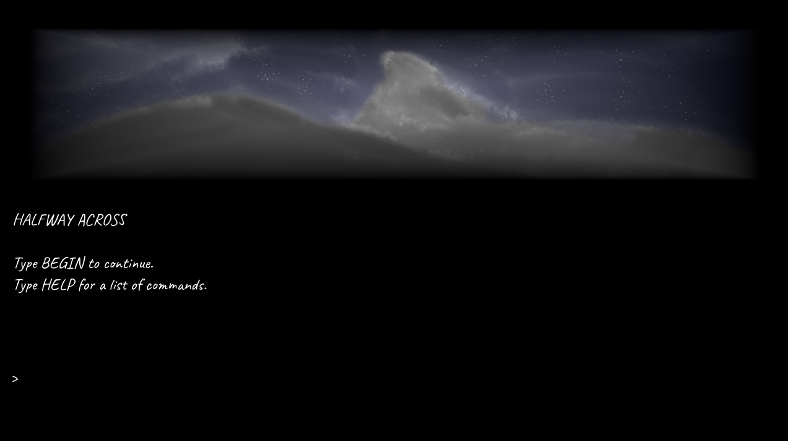

# Halfway Across Instruction Manual
## Quick Reference Guide

To move in a direction, use the keyword  **GO** or **MOVE** and a cardinal direction (North or N, West, East, South) or simply type the first letter of the cardinal direction. 

To seek out a given animal, use the command **HUNT (ANIMAL)**.

You are equipped with a possibles bag. To view its contents, use the command **LOOK IN BAG**.

To view known crafting recipes, use the command **READ RECIPES**.

To get information about your stats, use the command **REFLECT**.

**QUIT** terminates the game.

You can pass time by using the command **WAIT**.

## User Interface

The interface is split into three sections from top to bottom:
1. Setting image
2. Output
3. Prompt

## Survival
To survive the frontier, you must keep up on the following stats:
- Health (maintained by avoiding injury)
- Hunger (maintained by regularly eating food)
- Mental (maintained by having positive interactions with travelers)
- Thirst (maintained by regularly drinking water)
- Warmth (maintained by wearing clothes appropriate for the day's temperature)

The mental stat can be raised slightly by using the command **CRY**.

To get information about your stats, use the command **REFLECT**.

To check what clothing items you are wearing, use the command **LOOK AT SELF**.

To put on a clothing item, use the command **WEAR ITEM**.

To remove a clothing item, use the command **REMOVE ITEM**.

## Crafting
You can create useful items using the resources you acquire as you play. 

To view known crafting recipes, use the command **READ RECIPES**. 

If you possess all required resources for a particular recipe, you can craft it using the command **CRAFT RECIPE NAME**.

## Hunting
To hunt in the valley, the following items are required:
- A bow
- One or more arrows
- A hunting knife (if you intend to skin the animal)

Once you arrive at the valley, do the following:
1. Use the command **HUNT ANIMAL TYPE** to seek out a given animal
2. If one is found, use the command **SHOOT ARROW** to attempt to fell it
3. If successful, use the command **SKIN ANIMAL** if you want to harvest the animal's parts

## Ice Fishing
To fish at the lake, the following items are required:
- A chisel to break the ice
- A fishing rod
- Rendered fat (produced by cooking animal fat)

Once you arrive at the lake, do the following:
1. Use the command **USE CHISEL** to break the ice
2. Load the bait onto the rod using the command **LOAD FISHING ROD**
3. Use the command **USE FISHING ROD** to cast your line
4. Use the command **WAIT** to pass time

You will then be told what fish, if any, you caught.

## Resource Management
You are equipped with a possibles bag, you can view its contents with the command **LOOK IN BAG**. Each item you store in it takes up a certain amount of space, so you must be careful about what you choose to take with you when you leave your camp.

To put an item in your inventory, use the command **TAKE ITEM**. 

To remove an item from your inventory, use the command **DROP ITEM**.

## Social Interaction
You can converse with the travelers that cross your path. Keep in mind that your dialogue choices will effect how the other person perceives you.

To inquire about something, use the command **ASK PERSON'S NAME ABOUT TOPIC**. 

To inform the other person of something, use the command **TELL PERSON'S NAME ABOUT TOPIC**.
